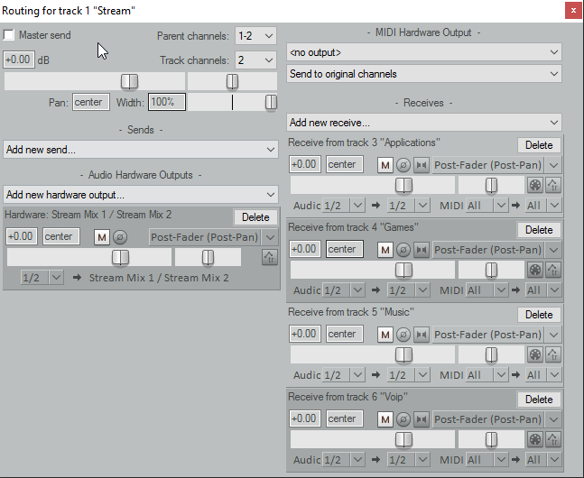
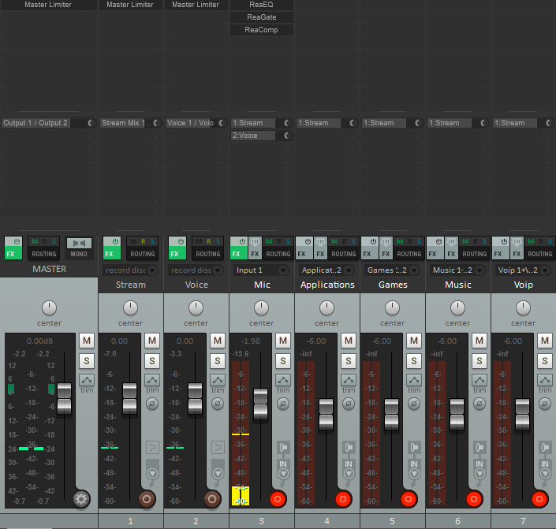

## Audio routing with a DAW

*(DAW: Digital Audio Workstation. Basically a software mixer, audio processor, VST host, recorder and many more things)*

This is probably the most flexible way to handle Audio a single computer setup - you can separate audio sources like applications,
games, VoIP applications (Skype, Discord etc.), control if only you or your stream should be able to hear them, process them
in real time and record them separately if needed.

The idea is that you create several virtual Windows audio devices, for example one for games, one for other applications,
whatever you need. Those devices feed into your DAW (along with your microphone) which you can use to control volumes and
whatever else you want to do with the audio. Then you send the audio from there into another virtual Windows audio device
which you can select in OBS/XSplit.

Installing the necessary tools is fairly quick, but you will have to invest some time into learning how to use
the DAW that you will be sending your audio through if you have never used one.

### Installing the tools

1. Make sure you have an ASIO driver. If you have an audio interface or any other (semi-)professional sound card it should have
one, otherwise you will need to use [Asio4All]. I won't cover how to set up Asio4All here, but it's really not hard.
2. Install [Synchronous Audio Router][SAR]
3. Pick your favorite DAW software and install it.

Some nice ones to choose from:

* [Ableton Live]: Developed for live performing and recording alike, has nice ways to use oneshot clips and extremely good MIDI
controller support
* [Studio One]: A bit more conventional, but still very slick UI. Has a free version, but unlike the paid one it doesn't support
VST plugins and the integrated plugin selection is rather small
* [Bitwig]: A bit like Ableton Live, but with a different flavor to it. Also somewhat performance oriented
* [Reaper]: UI is a bit harder to get into at first, but also very powerful and by far the cheapest of them all. Also, the trial
lasts 60 days and nothings stops you from using it after it expires. You should probably buy it after that, but nobody's forcing
you to.

They all have their own advantages and disadvantages, it can't hurt to download some of the trial versions and just see
what you like best. If it needs to be as cheap as possible, go with Reaper. **I'll explain the rest of this guide with Reaper
in mind because of that, but it's easily transferable to any of the other ones.**

### Setting up the Driver

If you want to get going as fast as possible, download this [configuration file][SAR config] and save it to `%appdata%\SynchronousAudioRouter`.
It has windows playback devices for Applications, Games, VoIP and Music, windows recording devices for the Stream and just your
Voice and will send all Steam games to the "Games" device without having to change anything.

If you have something else in mind, feel free to set up your own configuration directly in the driver.

1. Start your DAW with admin privileges (the SAR driver currently requires this to work)
2. Open the Audio driver settings. In Reaper, Options/Audio/Device.
3. Select ASIO Driver: Synchronous Audio Router
4. Click on "ASIO Configuration" and then select your driver under "Hardware Interface"
5. If you are not using the config file from above, you need to add your playback/recording devices in the driver now for
   all the channels that you will be needing. Keep in mind that a (windows) playback device will be an **input** in your DAW
   and a recording device will be an **output** in the DAW.
6. Now you need to add the new ASIO channels to your DAW. In Reaper, just select the first/last device each like shown
in the picture. You'll have to manually create and assign channels in most of the other DAWs. The first devices on the list
belong to your hardware, they might be named differently for you.

That's it, now you need to set up the DAW itself the way you want it.

### Setting up your routing in the DAW

First, create a channel for your Microphone. To do that, press `CTRL + T` to create it, and then set up the channel. This
is basically the same for any channel, whether it's a Microphone, an Application channel or something entirely different.

* Select the correct input channel
* Turn Monitoring to ON
* Arm the Track for Recording

You should now be able to hear things coming from this input. Next, repeat this for all the input channels you have.
It's probably a good idea to set all your channels to -6dB initially, so you never run into clipping issues. You can
always make up the lost volume in a limiter on the master.

Now you'll want to set up a bus channel for your stream mix and send the microphone channel to a separate output. Create
a channel, open its routing panel and select *Add new hardware output -> Stream Mix 1/Stream Mix 2* (assuming you used
the config file from above). Deselect *Send to Master*, and use *Add new receive -> Add receives from all tracks*. After
this the routing panel for the channel should look something like this: 

Alternatively, you could also just add the Stream output to your master channel, however you won't be able to exclude
certain channels from the stream if you do this. With the setup like above, you could just remove the send to stream from
any of the individual channels or turn down its volume to -inf dB and you'll have muted just that channel for the stream,
but you can still hear it.

Finally, add the *Voice 1/Voice 2* outputs to your Microphone channel.

You can now select the two audio devices (Voice and Stream) in the OBS settings. They will both be windows recording devices, so they'll
be listed under *Mic/Auxiliary Audio Device* in OBS Studio. There should be no other Audio devices selected in the OBS settings.
OBS should pick up your Audio now.

The final Reaper mixer panel looks like this now:

Next, you could add some VST plugins to your voice channel (like I have done here) and continue to customize things however
you need them.

[SAR]: https://github.com/eiz/SynchronousAudioRouter/releases "Synchronous Audio Router"
[Asio4All]: http://www.asio4all.com/
[Ableton Live]: https://www.ableton.com
[Studio One]: http://studioone.presonus.com/
[Bitwig]: https://www.bitwig.com
[Reaper]: http://www.reaper.fm/
[SAR config]: resources/default.json